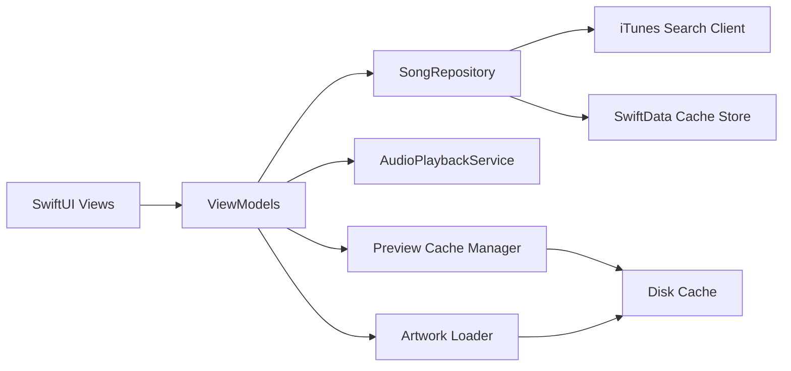

# MusicPlayerApp

MusicPlayerApp is an iOS Mobile App for music browsing and preview experience. The application integrates with the iTunes Search API, supports preview playback, persists cached data locally, and follows a feature-first MVVM structure with protocol-based boundaries and Swift Concurrency.

## References

- Requirement: [Music AI iPhone Challenge](https://moisesai.notion.site/iPhone-31f143d913108013a685dd9af4f657cb)
- Figma design: [Code Challenge](https://www.figma.com/design/uuhUN9OZYqNZkBxuDq9FWh/Code-Challenge?node-id=10985-10110&t=etEwvDfga5a2EMBw-4)
- iTunes API reference: [iTunes Search API](https://developer.apple.com/library/archive/documentation/AudioVideo/Conceptual/iTuneSearchAPI/UnderstandingSearchResults.html#//apple_ref/doc/uid/TP40017632-CH8-SW1)

## Platform

- Swift 6
- SwiftUI
- Minimum iOS version: `iOS 26.0`
- Device support in this submission: `iPhone only`

This implementation is intentionally optimized for the iPhone experience defined in the provided Figma. A dedicated iPad layout is not included in the current scope.

## Features

- Search-based song discovery powered by the iTunes Search API
- Preview playback using `AVPlayer`
- Album details flow from player and song options
- Recently played history
- Offline-friendly cache for search results, albums, and playback history using SwiftData
- Custom bottom sheet interactions for song options

## Extra Points Implemented

- Error and state handling
  - loading, empty, and failure states across the main flows
  - offline feedback for unavailable previews
- Swipe to refresh on the Home screen
- Repository organization with protocol-based boundaries and a cache-backed implementation
- Player improvements
  - forward and backward track actions
  - repeat current song
  - drag-to-seek playback position
  - visible playback timeline
- Share option
  - available from song options on Home, Album, and Player
- Accessibility support
  - identifiers, labels, hints, and values across the main feature flows
- Offline-first enhancements
  - artwork disk cache
  - manually downloaded preview cache for offline playback

## Architecture

The project is organized around feature-first MVVM with clear separation between domain, data, design system, and UI layers.

- `Core`: domain models and protocols
- `Data`: API integration, DTOs, mappers, repositories, playback, and caching
- `DesignSystem`: typography and colors
- `Features`: Home, Player, Album, Splash, Root, and shared UI components
- `Support`: dependency wiring, launch configuration, fixtures, and environment integration

Protocol-based abstractions keep feature code isolated from implementation details:

- `SongRepository`
- `MusicSearchService`
- `AlbumLookupService`
- `AudioPlaybackService`
- `HTTPClient`

The production repository uses live iTunes services plus a SwiftData-backed cache fallback.

## Architecture Diagram



## Swift Concurrency

Swift Concurrency is used throughout the app:

- `async/await` for network and repository operations
- `@MainActor` isolation for UI-facing state and services
- SwiftUI `.task` for screen lifecycle-driven loading
- `Task` usage for async UI-triggered operations such as search and playback updates

## Running The App

1. Open [MusicPlayerApp.xcodeproj](/Users/jeannchuab/Projects/jeannchuab/MusicPlayerApp/MusicPlayerApp/MusicPlayerApp.xcodeproj)
2. Select the `MusicPlayerApp` scheme
3. Choose an iPhone simulator running iOS 26.0 or newer
4. Build and run

## Running Tests

Run from Xcode using `Product > Test`, or use:

```bash
xcodebuild build -project MusicPlayerApp/MusicPlayerApp.xcodeproj -scheme MusicPlayerApp -destination generic/platform=iOS CODE_SIGNING_ALLOWED=NO
xcodebuild build-for-testing -project MusicPlayerApp/MusicPlayerApp.xcodeproj -scheme MusicPlayerApp -destination generic/platform=iOS CODE_SIGNING_ALLOWED=NO
```

UI tests support deterministic launch behavior through launch arguments:

- `--ui-testing`: launches the app with fixture data and silent playback services instead of live API-dependent behavior
- `--skip-splash`: skips the splash screen delay so UI tests start directly in the main flow

## Notes

- Playback uses the preview URLs returned by the iTunes Search API, so full-length songs are not available.
- The iTunes Search API does not provide documented server-side pagination beyond `limit`, so the app fetches a larger search result batch and paginates locally.
- Search, album data, and recently played songs are cached to improve resilience and support fallback behavior.
- The Home, Player, and Album flows share a reusable song options sheet component.

## Technical Decisions

- **Client-side pagination:** the iTunes Search API documents `limit`, but not a supported `offset` parameter for `/search`. To keep the user experience responsive and predictable, the app fetches a larger batch once and paginates locally.
- **Disk cache for artwork and previews:** binary assets are cached on disk instead of SwiftData. SwiftData is used for structured metadata, while files on disk are a better fit for larger remote assets and offline reuse.
- **Manual offline preview download:** preview files are only stored when the user explicitly chooses to save them. This keeps bandwidth and storage usage intentional while still enabling offline playback.
- **Offline-first home experience:** recently played songs, cached albums, cached search pages, artwork, and downloaded previews are all available without depending on a fresh network request.
- **Replaceable network layer:** feature code depends on protocols and repositories instead of concrete API clients, so the iTunes implementation can be swapped without changing the view models or screens.

## Screenshots

### Home

<p align="center">
  
  
</p>

### Player

<p align="center">
  
  
  
</p>

<p align="center">
  
  
</p>

### Album

<p align="center">
  
</p>

### Splash

<p align="center">
  
</p>
